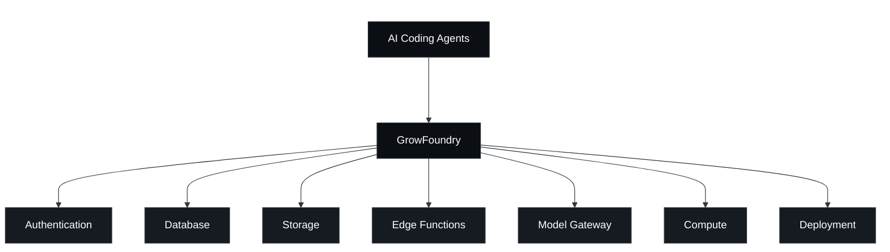
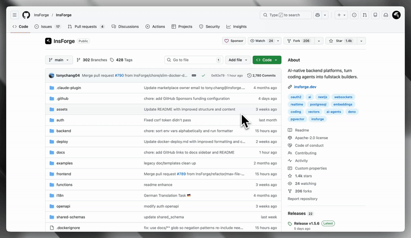

<div align="center">
  <a href="https://growfoundry.dev">
    <picture>
      <source media="(prefers-color-scheme: dark)" srcset="assets/logo-dark.svg">
      <source media="(prefers-color-scheme: light)" srcset="assets/logo-light.svg">
      
    </picture>
  </a>

  <p>
    The all-in-one, open-source backend platform for agentic coding.<br />
  </p>

  <p>
    <a href="https://opensource.org/licenses/Apache-2.0"></a>
    <a href="https://www.npmjs.com/package/@growfoundry/sdk"></a>
    <a href="https://github.com/GrowFoundry/GrowFoundry/graphs/contributors"></a>
    <a href="https://growfoundry.dev"></a>
    <a href="https://gitcgr.com/GrowFoundry/GrowFoundry">
      
    </a>
  </p>
  <p>
    <a href="https://x.com/GrowFoundry"></a>
    <a href="https://www.linkedin.com/company/growfoundry"></a>
    <a href="https://discord.com/invite/MPxwj5xVvW"></a>
  </p>
  <a href="https://trendshift.io/repositories/19834" target="_blank">
    
  </a>
  <br /><br />
  <a href="https://vercel.com/oss">
    
  </a>
</div>

<p align="center">
  ⭐ <em>Help us reach more developers and grow the GrowFoundry community. Star this repo!</em>
</p>

## GrowFoundry
The all-in-one, open-source backend platform for agentic coding. GrowFoundry gives your coding agent database, auth, storage, compute, hosting, and AI gateway to ship full-stack apps end-to-end.

https://github.com/user-attachments/assets/345efbc6-ca63-4189-bde0-12ef3bda561b

### How it works

Coding agents interact with GrowFoundry through one of two interfaces:

- **MCP Server** (self-hosted and cloud): exposes GrowFoundry's operations as tools any MCP-compatible agent can call.
- **CLI + Skills** (cloud only): a command-line interface paired with Skills that agents invoke directly from the terminal.

Both interfaces let coding agents operate the backend like backend engineers:

- **Read backend context and state**: Pull documentation, schemas, metadata (deployed functions, bucket contents, auth config), and runtime logs, so the agent has what it needs to write code, verify what it built, and debug when something breaks.
- **Configure primitives**: Deploy edge functions, run database migrations, create storage buckets, set up auth providers, and configure other backend resources directly.



### Core Products:
- **Authentication**: User management, authentication, and sessions
- **Database**: Postgres relational database
- **Storage**: S3 compatible file storage
- **Model Gateway**: OpenAI compatible API across multiple LLM providers
- **Edge Functions**: Serverless code running on the edge
- **Compute** (private preview): Long-running container services
- **Site Deployment**: Site build and deployment


## ⭐️ Star the Repository

<p align="center">
  
</p>

If you find GrowFoundry useful or interesting, a GitHub Star ⭐️ would be greatly appreciated.

## Quickstart

### Cloud-hosted: [growfoundry.dev](https://growfoundry.dev)

<a href="https://growfoundry.dev" target="_blank" rel="noopener noreferrer"></a>

### Self-hosted: Docker Compose

Prerequisites: [Docker](https://www.docker.com/) + [Node.js](https://nodejs.org/)

#### 1. Setup

You can run GrowFoundry locally using Docker Compose. This will start a local GrowFoundry instance on your machine.

[![Deploy on Docker][docker-btn]][docker-deploy]

Or run from source:
```bash
# Run with Docker
git clone https://github.com/GrowFoundry/GrowFoundry.git
cd growfoundry
cp .env.example .env
docker compose -f docker-compose.prod.yml up
```

#### 2. Connect GrowFoundry MCP

Open [http://localhost:7130](http://localhost:7130)

Follow the steps to connect GrowFoundry MCP Server

<div align="center">
  
</div>

#### 3. Verify installation

To verify the connection, send the following prompt to your agent:
```
I'm using GrowFoundry as my backend platform, call GrowFoundry MCP's fetch-docs tool to learn about GrowFoundry instructions.
```

#### 4. Running Multiple Projects

You can run multiple GrowFoundry projects on the same host by using different ports and project names.

```bash
# Create a separate env file for each project
cp .env.example .env.project1
cp .env.example .env.project2
```

Edit `.env.project2` with different ports:
```
POSTGRES_PORT=5442
POSTGREST_PORT=5440
APP_PORT=7230
AUTH_PORT=7231
DENO_PORT=7233
```

Start each project with a unique name:
```bash
docker compose -f docker-compose.prod.yml --env-file .env.project1 -p project1 up -d
docker compose -f docker-compose.prod.yml --env-file .env.project2 -p project2 up -d
```

Each project gets its own isolated database, storage, and configuration. Manage them with:
```bash
docker compose -f docker-compose.prod.yml --env-file .env.project1 -p project1 ps      # status
docker compose -f docker-compose.prod.yml --env-file .env.project1 -p project1 logs -f  # logs
docker compose -f docker-compose.prod.yml --env-file .env.project1 -p project1 down     # stop
```

### One-click Deployment

In addition to running GrowFoundry locally, you can also launch GrowFoundry using a pre-configured setup. This allows you to get up and running quickly with GrowFoundry without installing Docker on your local machine.

| Railway | Zeabur | Sealos |
| --- | --- | --- |
| [](https://railway.com/deploy/growfoundry) | [](https://zeabur.com/templates/Q82M3Y) | [](https://sealos.io/products/app-store/growfoundry) |


## Contributing

**Contributing**: If you're interested in contributing, you can check our guide here [CONTRIBUTING.md](CONTRIBUTING.md). We truly appreciate pull requests, all types of help are appreciated!

**Support**: If you need any help or support, we're responsive on our [Discord channel](https://discord.com/invite/MPxwj5xVvW), and also feel free to email us [info@growfoundry.dev](mailto:info@growfoundry.dev) too!


## Documentation & Support

### Documentation
- **[Official Docs](https://docs.growfoundry.dev/introduction)** - Comprehensive guides and API references

### Community
- **[Discord](https://discord.com/invite/MPxwj5xVvW)** - Join our vibrant community
- **[Twitter](https://x.com/GrowFoundry)** - Follow for updates and tips

### Contact
- **Email**: info@growfoundry.dev

## License

This project is licensed under the Apache License 2.0 - see the [LICENSE](LICENSE) file for details.

---

[](https://www.star-history.com/#GrowFoundry/GrowFoundry&Date)

## Badges

Show your project is built with GrowFoundry.

### Made with GrowFoundry

<a href="https://growfoundry.dev">
  
</a>

**Markdown:**
```md
[](https://growfoundry.dev)
```

**HTML:**
```html
<a href="https://growfoundry.dev">
  
</a>
```

### Made with GrowFoundry (dark)

<a href="https://growfoundry.dev">
  
</a>

**Markdown:**
```md
[](https://growfoundry.dev)
```

**HTML:**
```html
<a href="https://growfoundry.dev">
  
</a>
```


<p align="center">⭐ <b>Star us on GitHub</b> to get notified about new releases!</p>

<!-- LINK GROUPS -->

[docker-btn]: ./deploy/buttons/docker.png
[docker-deploy]: ./deploy/docker-deploy.md
