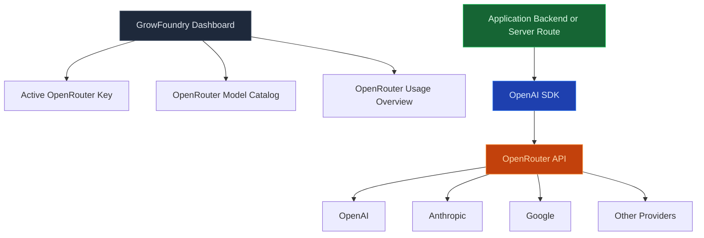

Use the Model Gateway to call chat, streaming, and embedding models through one OpenAI-compatible endpoint. GrowFoundry holds the provider keys, tracks usage per project, and routes traffic through [OpenRouter](https://openrouter.ai), so your application code never sees Anthropic, OpenAI, or Mistral credentials directly.

<Frame caption="One OpenAI-compatible endpoint with per-provider access, ready-to-copy code, and usage tracking.">
  
</Frame>

<Note>
  **Want to run AI code, not call a model?** Use [Edge Functions](/core-concepts/functions/overview) to orchestrate prompts, retrieval, and tools. The Model Gateway is the call; functions are the program around it.
</Note>

## Features

### OpenAI-compatible API

Point any OpenAI SDK or `openai`-compatible library at `https://<project>.growfoundry.dev/v1` and it works. `/v1/chat/completions`, `/v1/embeddings`, and `/v1/models` all behave like the upstream spec.

### Streaming

Server-sent events for chat completions. Use the streaming endpoint the same way you would with OpenAI; the gateway forwards tokens as they arrive from the provider.

### Embeddings

Generate dense vectors from any embedding model OpenRouter supports. Store the result in Postgres with [pgvector](/core-concepts/database/pgvector) for semantic search.

### Per-project quotas

Each project carries its own rate limit and spend cap. Hit it, and the gateway returns a clean 429 instead of leaking provider quota state into your app.

### Usage tracking

Every request is logged with model, token count, and cost. Query usage from the dashboard, CLI, or MCP — billing reconciles to OpenRouter's invoice automatically.

### Multi-provider routing

Switch between Anthropic, OpenAI, Mistral, Llama, Gemini, and dozens more by changing the model name in the request. Application code does not change.

## Build with it

<CardGroup cols={2}>
  <Card title="TypeScript SDK" icon="js" href="/sdks/typescript/ai">
    Chat, stream, and embed from Node, browser, and edge runtimes.
  </Card>

  <Card title="Swift SDK" icon="swift" href="/sdks/swift/ai">
    Native Swift AI client for iOS and macOS.
  </Card>

  <Card title="Kotlin SDK" icon="android" href="/sdks/kotlin/ai">
    Coroutines-first AI client for Android and JVM.
  </Card>

  <Card title="REST API" icon="code" href="/sdks/rest/ai">
    Plain HTTP AI endpoints, callable from any language.
  </Card>
</CardGroup>

## Next steps

- Set up the [CLI](/quickstart) to link your project (the recommended path).
- Browse the [TypeScript SDK reference](/sdks/typescript/ai) for chat and embedding patterns.
