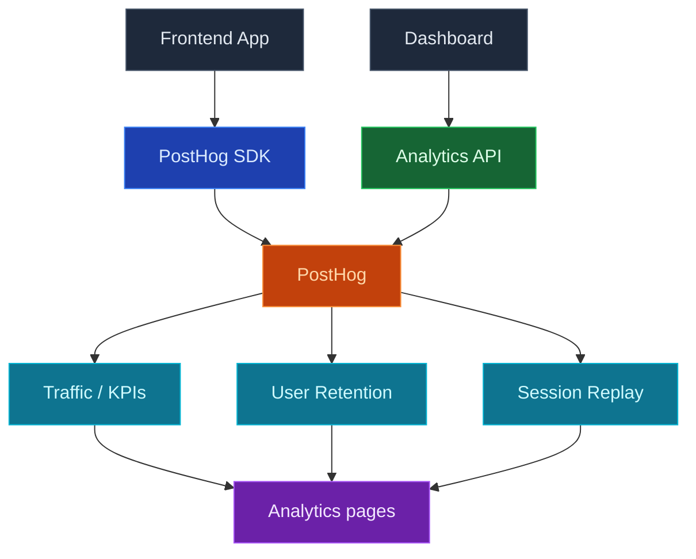

Use GrowFoundry Analytics to understand how people actually use your app: page traffic, retention, and session replays, all wired up by connecting a PostHog project to your GrowFoundry backend. Once connected, the dashboard renders Traffic, User Retention, and Session Replay pages on top of your PostHog data without leaving GrowFoundry.

Connect PostHog once with one click, drop the setup prompt into your coding agent so it runs the PostHog wizard and installs the PostHog SDK on your frontend, and the Analytics pages start filling in.

<Frame caption="Analytics dashboard: KPIs over time plus breakdowns by page, country, and device.">
  
</Frame>

<Note>
  PostHog remains the source of truth for events, dashboards, insights, and recordings. GrowFoundry surfaces a focused subset for everyday checks, then deep-links into PostHog for anything beyond it.
</Note>



## Features

### One-click PostHog connection

Connect PostHog from the Analytics page in the dashboard. GrowFoundry provisions or links a PostHog project for you, stores credentials server-side, and unlocks the Traffic, Retention, and Session Replay pages once the connection succeeds.

### SDK setup via PostHog wizard

After connecting, the empty state ships a setup prompt you can paste into your coding agent:

```
I want to add product analytics to this project. Read the current directory and use the GrowFoundry skill to set up PostHog analytics by running `npx @growfoundry/cli posthog setup`.
```

`@growfoundry/cli posthog setup` links your GrowFoundry project to PostHog, then prints the official [PostHog wizard](https://posthog.com/docs/libraries/wizard) command (`npx -y @posthog/wizard@latest`) for you (or your agent) to run next. The wizard detects your framework, installs the right PostHog SDK, and drops in initialization code so pageviews, autocapture events, and session recordings start flowing.

### Traffic

KPIs over your selected time range (visitors, pageviews, sessions, bounce rate, and trend), plus breakdowns by Page, Country, and Device Type. Useful for the first "how is the app doing this week" pass without opening PostHog.

### User retention

Cohort retention chart built from your PostHog events. Pick a time range and see how many users come back over the following days or weeks.

### Session replay

A paginated list of recent session recordings with duration, person, and a deep-link into PostHog's full replay player. Helps you watch what users actually did right after spotting something odd in Traffic or Retention.

### Settings and disconnect

The Analytics Config dialog (the gear icon in the sidebar) lets admins review the linked PostHog project, jump straight into PostHog, and disconnect when needed. Disconnecting only severs the GrowFoundry ↔ PostHog link; your PostHog project, events, and recordings stay intact.

## Concepts

<CardGroup cols={2}>
  <Card title="PostHog product analytics" icon="chart-mixed" href="https://posthog.com/docs/product-analytics">
    Events, autocapture, insights, and dashboards behind the Analytics pages.
  </Card>

  <Card title="PostHog session replay" icon="circle-play" href="https://posthog.com/docs/session-replay">
    How recordings are captured, redacted, and played back.
  </Card>
</CardGroup>

## Build with it

<CardGroup cols={2}>
  <Card title="PostHog wizard" icon="wand-magic-sparkles" href="https://posthog.com/docs/libraries/wizard">
    Auto-detects your framework, installs the right PostHog SDK, and adds initialization code.
  </Card>

  <Card title="PostHog JavaScript SDK" icon="js" href="https://posthog.com/docs/libraries/js">
    Capture custom events on top of what the wizard sets up.
  </Card>

  <Card title="GrowFoundry CLI" icon="terminal" href="/quickstart">
    `npx @growfoundry/cli posthog setup` links your GrowFoundry project to PostHog, then prints the wizard command.
  </Card>
</CardGroup>

## Next steps

- Open the Analytics page in the dashboard and click **Connect PostHog**.
- Paste the setup prompt into your coding agent, then run the `@posthog/wizard` command it prints to wire the SDK into your app.
- Set up the [CLI](/quickstart) if you want to manage the connection from the terminal.
