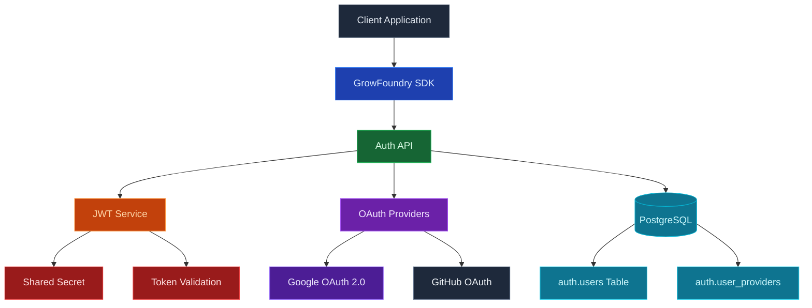

Use GrowFoundry Authentication to handle sign-up, login, sessions, and identity for your app. Users can sign in with email and password, magic link, one-time code, OAuth providers (Google, GitHub, Apple, and others), or any OIDC-compliant identity provider you bring. GrowFoundry issues JSON Web Tokens on login, and every other product on the platform consumes the same token.

<Frame caption="Configured sign-in methods: email and password, Google, and GitHub OAuth.">
  
</Frame>

<Note>
  **Authentication** is checking that a user is who they say they are. **Authorization** is checking what they can do. GrowFoundry handles the first directly and powers the second through [row-level security](/core-concepts/database/overview) policies that read the auth JWT.
</Note>

## Features

### Email and password

The default. New users sign up with an email and password, get a confirmation email, and receive a session JWT on login. Password reset, email verification, and brute-force throttling are built in.

### Magic link and OTP

Send a one-time link or six-digit code to the user's email. Passwordless sign-in, account recovery, and step-up auth all use the same primitive.

### OAuth providers

First-class support for Google, GitHub, Apple, Microsoft, GitLab, Discord, and more. Add custom OAuth 2.0 / OIDC providers (Keycloak, Okta, Auth0, your own IdP) by URL without writing provider-specific code.

### OAuth server mode

Run GrowFoundry itself as an OAuth 2.0 / OIDC identity provider for your own downstream apps. See the [OAuth Server guide](/oauth-server) for the full setup.

### Row-level security

The auth JWT flows through every GrowFoundry SDK call automatically. Postgres RLS policies read claims from the token and decide, row by row, what the user can read and write. The same identity and the same policies apply whether the request hits the database, storage, or a realtime channel.

### `auth.users` in your database

User state lives in your project's Postgres database in the `auth` schema. Join `auth.users` to your application tables via foreign keys, react to identity changes with triggers, and back the whole thing up the same way you back up everything else.

## Build with it

<CardGroup cols={2}>
  <Card title="TypeScript SDK" icon="js" href="/sdks/typescript/auth">
    Sign up, log in, and manage sessions from Node, browser, and edge.
  </Card>

  <Card title="Swift SDK" icon="swift" href="/sdks/swift/auth">
    Native Swift auth client for iOS and macOS.
  </Card>

  <Card title="Kotlin SDK" icon="android" href="/sdks/kotlin/auth">
    Coroutines-first auth client for Android and JVM.
  </Card>

  <Card title="REST API" icon="code" href="/sdks/rest/auth">
    Plain HTTP auth endpoints, callable from any language.
  </Card>
</CardGroup>

## Next steps

- Set up the [CLI](/quickstart) to link your project (the recommended path).
- Browse the [TypeScript SDK reference](/sdks/typescript/auth) for sign-in patterns.
