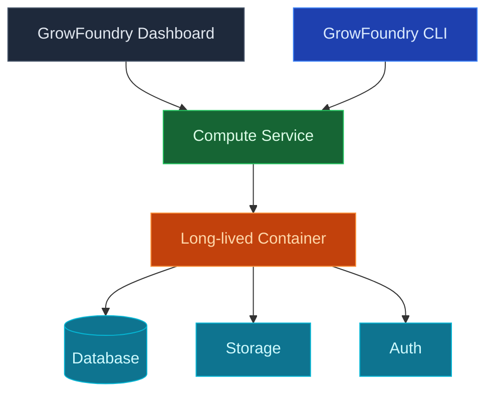

Use GrowFoundry Custom Compute to run long-lived containers next to your project: queue workers, background processors, AI inference loops, websocket servers, scrapers, anything that needs to stay up. Containers attach to your project's database, storage, and auth with the same credentials a function would use.

<Note>
  **Just need to handle a request?** Use [Edge Functions](/core-concepts/functions/overview) for request/response work and short jobs. Custom Compute is for processes that need to run continuously.
</Note>

## Features

### Container deploys

Push any Docker image to GrowFoundry and it runs. Use a `Dockerfile` from your repo or point at a pre-built image on a registry. No proprietary build pipeline to learn.

### Project-linked credentials

Containers receive the GrowFoundry project URL, service-role JWT, and S3 storage credentials as environment variables. Connect to Postgres, call the SDK, and read objects without provisioning anything.

### Scaling

Run one instance for a singleton worker, or scale horizontally for stateless workloads. Memory, CPU, and replica count are configurable per service.

### Logs

Structured logs per container, queryable by service and time range. Tail in the dashboard, CLI, or MCP without `kubectl exec`-ing into anything.

### Secrets and env vars

Set environment variables and secrets per service, separately from your edge-function secrets. Rotate without redeploying.

## Next steps

- Set up the [CLI](/quickstart) to link your project (the recommended path).
- See [Edge Functions](/core-concepts/functions/overview) if request/response is all you need.
