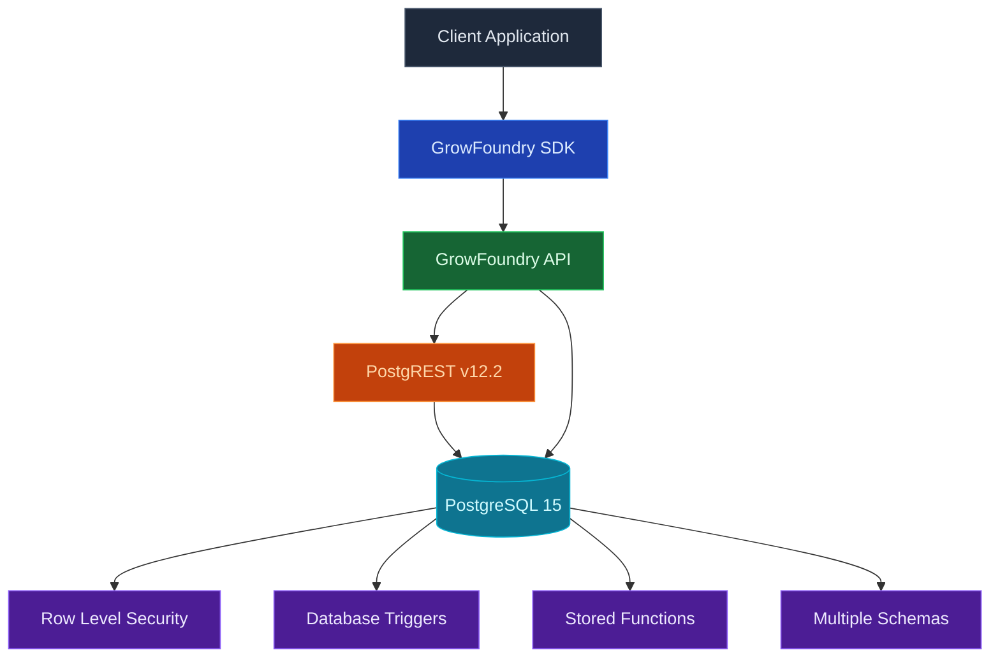

Every GrowFoundry project comes with a full [Postgres](https://www.postgresql.org/) database. Every table is automatically a typed REST and SDK endpoint. Auth tokens scope every read and write through row-level security. The same Postgres handles relational queries, semantic search via pgvector, and realtime change feeds.

<Frame caption="The table editor: typed columns, inline editing, CSV import, and a SQL studio.">
  
</Frame>

<Note>
  **Looking for file storage?** Use [Storage](/core-concepts/storage/overview) for images, PDFs, and other binary content. The database stores rows; storage stores objects.
</Note>

## Features

### Tables as APIs

Define a table and you immediately get REST endpoints plus a typed SDK client for it. No code generation step. The auth JWT scopes every query through RLS.

### Migrations

Track and apply SQL changes in order. [Migrations](/core-concepts/database/migrations) ship as plain `.sql` files in your repo, applied with `npx @growfoundry/cli db migrations up --all` or via the MCP tool.

### Branching

Spin up an isolated database branch to test risky schema changes against a copy of production data. See [Branching](/agent-native/branching).

### pgvector

Native vector search for embeddings, with HNSW and IVFFlat indexes. See [pgvector](/core-concepts/database/pgvector).

### Row-level security

Postgres RLS policies enforce access at the row level. Policies read the auth JWT, so the same rule applies to REST queries, SDK calls, realtime subscriptions, and storage requests.

## Concepts

<CardGroup cols={2}>
  <Card title="Migrations" icon="layer-group" href="/core-concepts/database/migrations">
    Apply SQL changes in order, safely.
  </Card>
  <Card title="Branching" icon="code-branch" href="/agent-native/branching">
    Isolated databases for preview and risky changes.
  </Card>
  <Card title="pgvector" icon="brain" href="/core-concepts/database/pgvector">
    Vector search for embeddings.
  </Card>
</CardGroup>

## Build with it

<CardGroup cols={2}>
  <Card title="TypeScript SDK" icon="js" href="/sdks/typescript/database">
    Typed queries, inserts, and updates from Node, browser, and edge.
  </Card>

  <Card title="Swift SDK" icon="swift" href="/sdks/swift/database">
    Native Swift database client for iOS and macOS.
  </Card>

  <Card title="Kotlin SDK" icon="android" href="/sdks/kotlin/database">
    Coroutines-first database client for Android and JVM.
  </Card>

  <Card title="REST API" icon="code" href="/sdks/rest/database">
    Plain HTTP database endpoints, callable from any language.
  </Card>
</CardGroup>

## Next steps

- Set up the [CLI](/quickstart) to link your project (the recommended path).
- Browse the [TypeScript SDK reference](/sdks/typescript/database) for typed queries.
