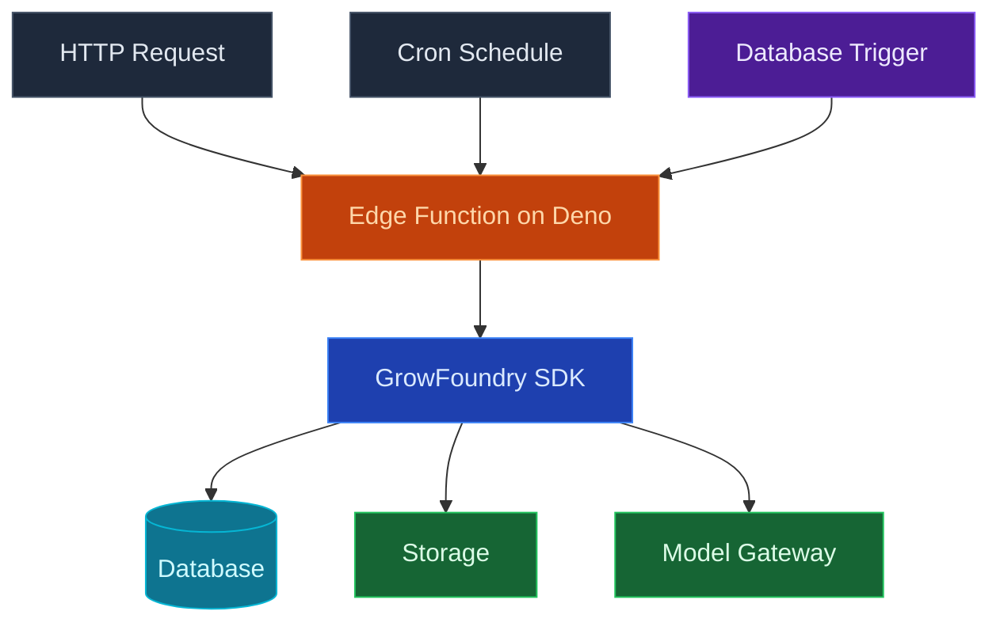

Use GrowFoundry edge functions to run TypeScript on [Deno](https://deno.com), deployed close to your users for low latency. Functions can be invoked on-demand from any client, chained from database triggers, or scheduled to run on a cron expression. The runtime ships standard fetch, streaming responses, and ESM imports out of the box.

<Note>
  **Need a process that stays up?** Use [Compute](/core-concepts/compute/overview) for queue workers, AI inference loops, and anything stateful. Edge Functions are for request/response and short-lived jobs.
</Note>

## Features

### HTTP triggers

Every function is reachable at `https://<project>.growfoundry.dev/functions/<name>`. Standard fetch in, standard `Response` out. Streaming, JSON, redirects, and websockets all work.

### Schedules

Attach a cron expression to a function and GrowFoundry invokes it on time, with retry on failure. See [Schedules](/core-concepts/functions/schedules) for the cron syntax and execution model.

### Database triggers

Wire a function to fire on `INSERT`, `UPDATE`, or `DELETE` against a table. The function receives the row payload and runs with a service-role JWT so it can perform privileged follow-up writes.

### Secrets and environment variables

Set env vars and secrets per function. The dashboard, CLI, and MCP all read and write the same store; secrets never round-trip through your repo.

### Logs

Structured logs are captured per invocation, queryable by status, duration, and function name. The GrowFoundry MCP `get-function-logs` tool lets your agent diagnose failures without leaving the editor.

### Deno standard library

Use the [Deno standard library](https://jsr.io/@std) and any ESM module from `jsr.io`, `esm.sh`, or `npm:` specifiers. You don't run a bundler, and there's no `node_modules` directory to ship.

## Concepts

<CardGroup cols={2}>
  <Card title="Schedules" icon="clock" href="/core-concepts/functions/schedules">
    Run a function on a cron expression instead of in response to a request.
  </Card>
</CardGroup>

## Build with it

<CardGroup cols={2}>
  <Card title="TypeScript SDK" icon="js" href="/sdks/typescript/functions">
    Invoke and stream functions from Node, browser, and edge.
  </Card>

  <Card title="Swift SDK" icon="swift" href="/sdks/swift/functions">
    Invoke functions from iOS and macOS apps.
  </Card>

  <Card title="Kotlin SDK" icon="android" href="/sdks/kotlin/functions">
    Invoke functions from Android and JVM apps.
  </Card>

  <Card title="REST API" icon="code" href="/sdks/rest/functions">
    Plain HTTP function endpoints, callable from any language.
  </Card>
</CardGroup>

## Next steps

- Set up the [CLI](/quickstart) to link your project (the recommended path).
- Browse the [TypeScript SDK reference](/sdks/typescript/functions) for invocation patterns.
