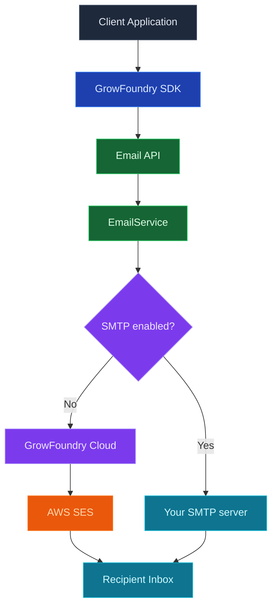

GrowFoundry Messaging sends transactional notifications from your project: receipts, digests, password-reset codes, notification roll-ups, anything you would otherwise wire SendGrid, Postmark, or Twilio in for. Email is the first channel; SMS and push are on the roadmap and will share the same API surface.

<Note>
  **Just sending auth emails?** Magic links, verification codes, and password resets are wired into [Authentication](/core-concepts/authentication/overview) out of the box. You only need this product for transactional messages beyond auth.
</Note>

## Channels

<CardGroup cols={3}>
  <Card title="Email" icon="envelope" href="/core-concepts/messaging/custom-smtp">
    Managed SMTP or bring your own provider. Templates, delivery tracking, and webhook events.
  </Card>

  <Card title="SMS" icon="message">
    Coming soon. Same API, Twilio or Sinch on the back.
  </Card>

  <Card title="Push" icon="bell">
    Coming soon. APNs and FCM via a single endpoint.
  </Card>
</CardGroup>

## Features

### One API, every channel

Same `emails.send()` shape for email today, with SMS and push to follow when they land. Switching channels is a field change, not a rewrite.

### Managed delivery or bring your own

Send through GrowFoundry Cloud (AWS SES for email today) for zero setup, or plug in your own provider when you need to control deliverability and sender reputation. See [Custom SMTP](/core-concepts/messaging/custom-smtp).

### Templates

Pick a template by name, pass the variables, and GrowFoundry renders and sends. Templates are editable per project; the four auth templates (`email-verification-*`, `reset-password-*`) ship with sensible defaults.

### Delivery tracking

Send events (`accepted`, `delivered`, `bounced`, `complained`) are recorded per message. Query the audit table in Postgres, subscribe over webhooks, or watch the dashboard.

### Rate limits

Per-project and per-plan limits keep stray loops from melting deliverability. Configurable from the dashboard, enforced at the gateway.

## Concepts

<CardGroup cols={2}>
  <Card title="Custom SMTP" icon="envelope" href="/core-concepts/messaging/custom-smtp">
    Bring your own SMTP provider (SendGrid, Postmark, AWS SES, etc.).
  </Card>
</CardGroup>

## Build with it

<CardGroup cols={2}>
  <Card title="TypeScript SDK" icon="js" href="/sdks/typescript/email">
    Send mail from Node, browser, and edge runtimes.
  </Card>

  <Card title="REST API" icon="code" href="/sdks/rest/overview">
    Plain HTTP messaging endpoints, callable from any language.
  </Card>
</CardGroup>

## Next steps

- Set up the [CLI](/quickstart) to link your project (the recommended path).
- Browse the [TypeScript SDK reference](/sdks/typescript/email) for send patterns.
