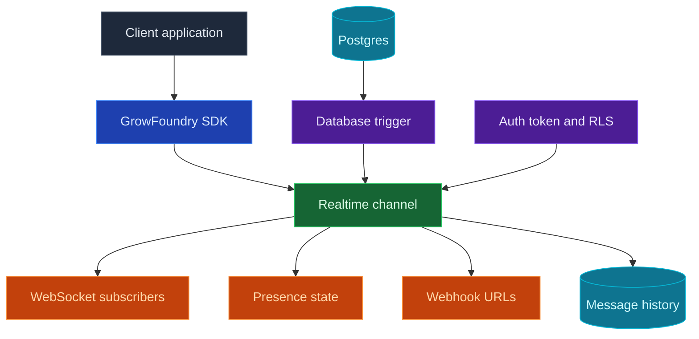

Use GrowFoundry Realtime when your app needs to update without a page refresh. Clients subscribe to channels such as `order:123` or `chat:room-1`, then receive database changes, broadcasts, and presence updates over WebSockets. Channels can also fan out the same messages to webhook URLs when another service should receive the event.

<Frame caption="Realtime dashboard: channel patterns, message history, permissions, and retention settings.">
  
</Frame>

<Note>
  **Need server-side code to run after a database change?** Put that business logic in an [Edge Function](/core-concepts/functions/overview) and invoke it from a database trigger. Use Realtime when the change should be delivered to connected clients or configured webhook endpoints.
</Note>



## Features

### Channels

Channels are named topics that clients can join. Use exact names for shared rooms, or patterns like `order:%` when every record needs its own live stream.

### Database changes

Use database changes when a table write should become a live app event. Create a trigger on the table you want to watch. In its trigger function, call the predefined `realtime.publish(channel, event, payload)` function to decide which channel receives the message, which event name clients handle, and what payload they receive.

For a channel pattern such as `order:%`, a trigger can publish one event per order:

```sql
CREATE OR REPLACE FUNCTION public.notify_order_status()
RETURNS TRIGGER AS $$
BEGIN
  PERFORM realtime.publish(
    'order:' || NEW.id::text,
    'status_changed',
    jsonb_build_object(
      'id', NEW.id,
      'status', NEW.status,
      'updatedAt', NEW.updated_at
    )
  );

  RETURN NEW;
END;
$$ LANGUAGE plpgsql SECURITY DEFINER;

CREATE TRIGGER order_status_realtime
  AFTER UPDATE OF status ON public.orders
  FOR EACH ROW
  WHEN (OLD.status IS DISTINCT FROM NEW.status)
  EXECUTE FUNCTION public.notify_order_status();
```

Then subscribe from the app with the SDK:

```typescript
const channel = `order:${orderId}`;

await growfoundry.realtime.connect();

const subscription = await growfoundry.realtime.subscribe(channel);
if (!subscription.ok) {
  throw new Error(subscription.error.message);
}

growfoundry.realtime.on('status_changed', (message) => {
  renderOrderStatus(message.status);
});
```

### Client broadcasts

Clients can publish messages to channels they have already joined. Use this for chat, typing indicators, cursors, collaborative editing signals, and other user-to-user updates that do not need to start from a database write.

```typescript
await growfoundry.realtime.publish(`chat:${roomId}`, 'typing', {
  userId,
  isTyping: true
});
```

### Webhooks

Attach webhook URLs to a channel when another service should receive each message. GrowFoundry posts the event payload to every configured URL, includes headers for the event name, channel, and message ID, retries transient network failures, and records webhook delivery counts in message history.

### Presence

Presence tracks who is online in a channel. Clients receive the current member snapshot when they subscribe, then `presence:join` and `presence:leave` events as members come and go. Store durable room membership, roles, and permissions in your own tables; presence is only online state.

```typescript
const response = await growfoundry.realtime.subscribe(`chat:${roomId}`);

if (response.ok) {
  renderOnlineMembers(response.presence.members);
}

growfoundry.realtime.on('presence:join', (message) => {
  addOnlineMember(message.member);
});

growfoundry.realtime.on('presence:leave', (message) => {
  removeOnlineMember(message.member.presenceId);
});
```

### Row-level security

Realtime can be open while prototyping, then locked down with Postgres RLS. Use `SELECT` policies on `realtime.channels` to control who can subscribe, and `INSERT` policies on `realtime.messages` to control who can publish from a client.

This policy lets authenticated users subscribe to `order:<id>` channels only when the order belongs to them:

```sql
ALTER TABLE realtime.channels ENABLE ROW LEVEL SECURITY;

CREATE POLICY "users_subscribe_own_orders"
ON realtime.channels
FOR SELECT
TO authenticated
USING (
  pattern = 'order:%'
  AND EXISTS (
    SELECT 1
    FROM public.orders
    WHERE id = NULLIF(split_part(realtime.channel_name(), ':', 2), '')::uuid
      AND user_id = auth.uid()
  )
);
```

Use `realtime.channel_name()` in subscribe policies because clients subscribe to resolved channels such as `order:123`, while `realtime.channels` stores patterns such as `order:%`.

### Message history

Every delivered event is recorded with WebSocket and webhook delivery counts. The dashboard can inspect recent messages, delivery stats, and retention settings when you need to debug live behavior.

## Build with it

<CardGroup cols={2}>
  <Card title="TypeScript SDK" icon="js" href="/sdks/typescript/realtime">
    Subscribe to channels, publish events, and track presence from Node, browser, and edge.
  </Card>

  <Card title="Swift SDK" icon="swift" href="/sdks/swift/realtime">
    Native Swift realtime client for iOS and macOS.
  </Card>

  <Card title="Kotlin SDK" icon="android" href="/sdks/kotlin/realtime">
    Coroutines-first realtime client for Android and JVM.
  </Card>

  <Card title="REST and WebSocket API" icon="code" href="/sdks/rest/realtime">
    Use the raw Socket.IO contract from any language.
  </Card>
</CardGroup>

## Next steps

- Set up the [CLI](/quickstart) to link your project.
- Create channels in the Realtime dashboard.
- Use the [TypeScript SDK reference](/sdks/typescript/realtime) for client subscriptions.
- Add webhook URLs to a channel when another service needs the same event stream.
