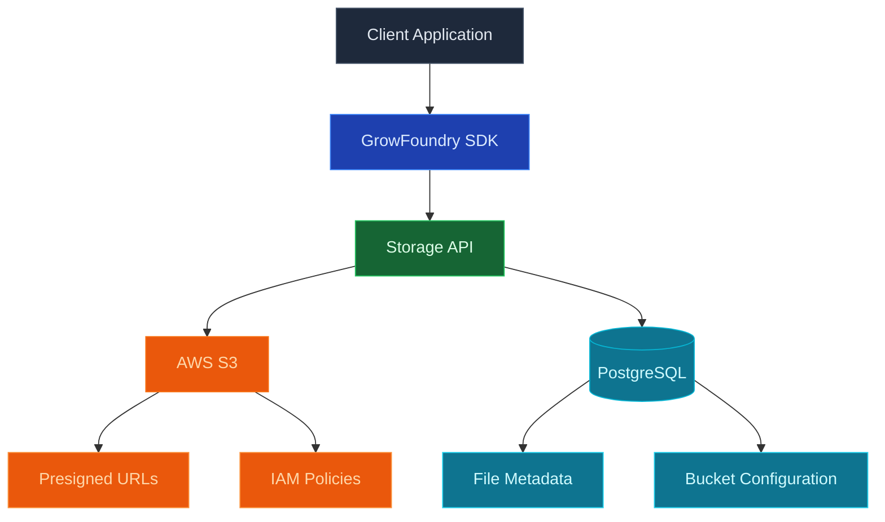

Use GrowFoundry to store and serve large binary files: images, videos, PDFs, audio, backups, anything you would not put in a database row. Every project gets an S3-compatible bucket. Files are served behind signed URLs, access policies follow the same row-level security model as the database, and the S3 API works with rclone, the AWS CLI, Terraform, and SDKs in any language.

<Frame caption="The storage browser: buckets, file listing, and uploads, all behind the same RLS as the database.">
  
</Frame>

<Note>
  **Looking for structured data?** Use [Database](/core-concepts/database/overview) for rows, relations, and queries. Storage holds objects; the database holds rows. Keep file metadata (owner, name, size, content type) in a database table and the bytes in storage.
</Note>

## Features

### S3-compatible API

Point any S3 client at your project's bucket. Native AWS credentials, native multipart uploads, native presigned URLs. See [S3 compatibility](/core-concepts/storage/s3-compatibility).

### Signed URLs

Generate time-limited URLs to share private objects without exposing your credentials. The SDK and REST API both issue signed URLs for upload and download.

### Row-level security

Storage policies read the same auth JWT as database queries. The same user who can `SELECT` a row can `GET` the file the row references, so you never maintain a separate set of storage permissions.

### Buckets

Group objects into buckets with separate access policies. Public buckets serve files directly over HTTPS; private buckets require a signed URL or an authenticated request.

### Direct uploads

Browser and mobile clients upload straight to storage with a presigned URL. The backend never proxies bytes.

## Concepts

<CardGroup cols={2}>
  <Card title="S3 compatibility" icon="bucket" href="/core-concepts/storage/s3-compatibility">
    Point any S3 client at your project's bucket with native credentials.
  </Card>
</CardGroup>

## Build with it

<CardGroup cols={2}>
  <Card title="TypeScript SDK" icon="js" href="/sdks/typescript/storage">
    Upload, download, list, and manage objects from Node, browser, and edge.
  </Card>

  <Card title="Swift SDK" icon="swift" href="/sdks/swift/storage">
    Native Swift storage client for iOS and macOS.
  </Card>

  <Card title="Kotlin SDK" icon="android" href="/sdks/kotlin/storage">
    Coroutines-first storage client for Android and JVM.
  </Card>

  <Card title="REST API" icon="code" href="/sdks/rest/storage">
    Plain HTTP storage endpoints, callable from any language.
  </Card>
</CardGroup>

## Next steps

- Set up the [CLI](/quickstart) to link your project (the recommended path).
- Browse the [TypeScript SDK reference](/sdks/typescript/storage) for uploads and downloads.
