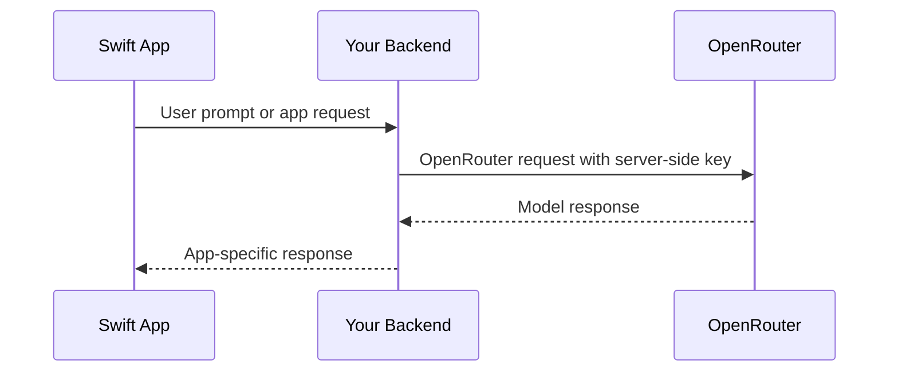

## Overview

GrowFoundry provisions an OpenRouter API key for Model Gateway projects. New Swift applications should call OpenRouter directly from trusted server-side code, a backend API, or another secure boundary. Do not embed the OpenRouter key in an iOS, macOS, tvOS, or watchOS app binary.

The previous GrowFoundry Swift AI SDK methods are deprecated compatibility wrappers. Use the GrowFoundry SDK for database, auth, storage, functions, and realtime; use OpenRouter for model calls.

## Recommended Architecture



## Server-Side OpenRouter Call

Use the OpenAI SDK or REST from your backend. For TypeScript backends:

```typescript
import OpenAI from 'openai';

const openai = new OpenAI({
  baseURL: 'https://openrouter.ai/api/v1',
  apiKey: process.env.OPENROUTER_API_KEY,
});

const completion = await openai.chat.completions.create({
  model: 'openai/gpt-4o-mini',
  messages: [{ role: 'user', content: 'Summarize this note.' }],
});
```

## Calling Your Backend from Swift

```swift
struct ChatRequest: Encodable {
    let prompt: String
}

struct ChatResponse: Decodable {
    let text: String
}

func sendPrompt(_ prompt: String, sessionToken: String) async throws -> ChatResponse {
    let url = URL(string: "https://your-app.example/api/chat")!
    var request = URLRequest(url: url)
    request.httpMethod = "POST"
    request.setValue("Bearer \(sessionToken)", forHTTPHeaderField: "Authorization")
    request.setValue("application/json", forHTTPHeaderField: "Content-Type")
    request.httpBody = try JSONEncoder().encode(ChatRequest(prompt: prompt))

    let (data, response) = try await URLSession.shared.data(for: request)
    guard let httpResponse = response as? HTTPURLResponse,
          (200..<300).contains(httpResponse.statusCode) else {
        throw URLError(.badServerResponse)
    }

    return try JSONDecoder().decode(ChatResponse.self, from: data)
}
```

Use an app session token or another user-scoped credential for your backend route. Never send the OpenRouter key from a Swift client.

## Legacy GrowFoundry AI Methods

These Swift SDK methods are deprecated for new AI integrations:

- `growfoundry.ai.chatCompletion(...)`
- `growfoundry.ai.generateEmbeddings(...)`
- `growfoundry.ai.generateImage(...)`
- `growfoundry.ai.listModels()`

They target the deprecated GrowFoundry AI proxy. New integrations should use the OpenRouter key from the dashboard and follow OpenRouter's current API docs for model parameters and capabilities.
